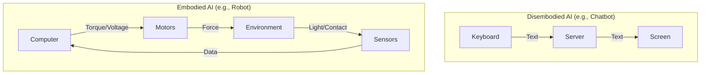
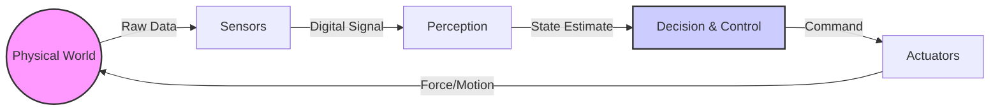

## Motivation

### The Limits of Disembodied Intelligence

For decades, Artificial Intelligence has been dominated by the "software-first" paradigm. From the logic theorists of the 1950s to the Large Language Models (LLMs) of today, the primary focus has been on symbolic manipulation and pattern recognition within a digital realm. While these systems have achieved superhuman performance in games like Chess and Go, or in generating human-like text, they often stumble when faced with the messy, unstructured reality of the physical world.

This discrepancy is famously encapsulated in **Moravec's Paradox**, formulated by Hans Moravec in the 1980s. It observes that high-level reasoning requires very little computation, but low-level sensorimotor skills require enormous computational resources. In other words, it is comparatively easy to make a computer beat a grandmaster at chess, but incredibly difficult to give it the perception and mobility of a one-year-old child.

### Why Physical AI Now?

We are currently witnessing a paradigm shift driven by the convergence of three key factors:

1.  **Hardware Acceleration**: The availability of powerful, energy-efficient GPUs and TPUs allows for real-time processing of complex sensory data (vision, lidar, tactile) on the edge.
2.  **Sim-to-Real Transfer**: Advanced physics engines (like NVIDIA Isaac Sim, Mujoco) enable robots to learn policies in simulation that can be successfully deployed in the real world, overcoming the "sample inefficiency" of training on physical hardware.
3.  **Foundation Models for Control**: The success of Transformers in NLP is being translated to robotics. "Vision-Language-Action" (VLA) models allow robots to understand natural language commands and reason about the physical world in a generalizable way.

Physical AI represents the next frontier: moving intelligence out of the server room and into the physical environment.

## Definitions

To navigate the field of Physical AI, we must first define our terms and distinguish them from related concepts.

### What is Physical AI?

**Physical AI** is the branch of Artificial Intelligence concerned with systems that interact with the physical world through **perception** (sensing) and **action** (actuation). Unlike a chatbot that lives on a server and outputs text, a Physical AI agent exists in the real world (or a simulation of it) and outputs physical forces.

> **Formal Definition**: A Physical AI system is an agent $A$ that maximizes a reward function $R$ by taking actions $u_t$ in a physical environment $E$, based on observations $o_t$ derived from physical sensors.



### Embodied Intelligence

**Embodied Intelligence** is the hypothesis that intelligence is not just a computational process in the brain (or CPU) but requires a body to interact with the environment. The body itself—its shape, material properties, and sensor layout—performs computation.

For example, a passive dynamic walker (a robot that walks down a slope without motors) uses its mechanical structure to achieve stable gait. The "intelligence" of walking is offloaded to the physics of its body. This contrasts with the "Computationalist" view, which treats the body merely as a peripheral device for the brain.

### Physical AI vs. Traditional Robotics

| Feature | Traditional Robotics | Physical AI |
| :--- | :--- | :--- |
| **Control** | Explicit programming, PID loops | Learned policies (RL), Neural Networks |
| **Environment** | Structured, predictable (factory lines) | Unstructured, dynamic (homes, streets) |
| **Adaptability** | Brittle; fails if conditions change | Robust; generalizes to new scenarios |
| **Data Source** | Hand-crafted models | Large-scale real-world & sim data |

## Components

A Physical AI system can be modeled as a feedback control loop consisting of four primary components. These components must operate in real-time, often within milliseconds, to ensure stability and safety.



### 1. Sensing (The "Eyes" and "Ears")
Sensors convert physical quantities into digital signals.
*   **Exteroceptive Sensors**: Measure the state of the external environment (e.g., Cameras, LiDAR, Radar, Microphones).
*   **Proprioceptive Sensors**: Measure the internal state of the robot (e.g., IMUs, Encoders, Torque sensors).

### 2. Perception (The "Brain" - Part I)
Perception algorithms process raw sensor data into a structured understanding of the world. This involves state estimation (Where am I?) and semantic understanding (What is around me?).
*   **Tasks**: Object detection, segmentation, SLAM (Simultaneous Localization and Mapping).
*   **Modern Approach**: Deep Neural Networks (CNNs, Transformers) trained on massive datasets.

### 3. Decision Making & Control (The "Brain" - Part II)
Once the state is known, the agent must decide how to act to achieve its goal.
*   **Planning**: Long-term strategy (e.g., "Pathfind from A to B").
*   **Control**: Low-level motor commands (e.g., "Apply 5Nm torque to joint 3").
*   **Learning**: Reinforcement Learning (RL) agents learn these policies through trial and error in simulation.

### 4. Actuation (The "Muscles")
Actuators convert control signals into physical force and motion.
*   **Types**: Electric motors (DC, BLDC), hydraulics, pneumatics, soft actuators.
*   **Constraints**: Limited by power, torque, thermal limits, and bandwidth. The software must respect these physical limits to avoid damaging the hardware.

#### Example: A Simple Control Loop
Here is a simplified Python representation of a robot's main control loop, running at 100Hz:

```python
import time

class RobotAgent:
    def sense(self):
        # Read from sensors (e.g., camera, lidar, encoders)
        return {"position": 10.0, "velocity": 0.5}

    def plan(self, observation):
        # Simple Proportional Control (P-Controller)
        target_position = 12.0
        error = target_position - observation["position"]
        kp = 2.0 # Gain
        torque_command = kp * error
        return torque_command

    def act(self, command):
        # Send command to motor drivers
        print(f"Applying Torque: {command} Nm")

def main():
    robot = RobotAgent()
    rate = 0.01 # 10ms loop time (100Hz)
    
    while True:
        start_time = time.time()
        
        # The Sense-Plan-Act Loop
        obs = robot.sense()
        cmd = robot.plan(obs)
        robot.act(cmd)
        
        # Maintain fixed loop rate
        elapsed = time.time() - start_time
        time.sleep(max(0, rate - elapsed))

if __name__ == "__main__":
    main()
```


## Summary

Physical AI is the bridge between the digital world of algorithms and the physical world of atoms. In this chapter, we established that:

1.  **Physical AI $\neq$ Disembodied AI**: It requires handling the uncertainty, noise, and dynamics of the real world, tackling **Moravec's Paradox**.
2.  **Embodiment Matters**: The physical body is not just a container; it is an integral part of the intelligent system.
3.  **The Loop**: A robot operates in a continuous **Sense-Plan-Act** loop (Sensing $\rightarrow$ Perception $\rightarrow$ Control $\rightarrow$ Actuation), constrained by real-time physics.

In the next chapter, we will dive deeper into the mathematical foundations of this loop, starting with **Linear Algebra and Rigid Body Transformations**, giving us the tools to describe where things are in space.
