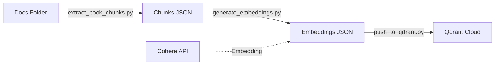

# Implementation Plan - Qdrant Vector Database & Book Embeddings

## Technical Context

**Feature**: `014-qdrant-book-vectors`

### Constraints
- **Language**: Python 3.11+
- **Vector DB**: Qdrant Cloud (Free Tier)
- **Embedding Model**: Cohere `embed-english-v3.0` (1024d)
- **Input**: Markdown files in `docs/`
- **Output**: Populated `book_vectors` collection

### Dependencies
- `qdrant-client`: For vector DB interaction.
- `cohere`: For generating embeddings.
- `langchain-text-splitters`: For smart chunking.
- `python-dotenv`: For managing secrets.

### Integrations
- **Docusaurus**: Source of truth for content.
- **Qdrant Cloud**: Destination for vectors.
- **Cohere API**: Processing engine.

## Constitution Check

### Compliance
- **AI Responsibility**: Not directly generating content here, but preparing data for it. Data is from our own source (book).
- **Data Privacy**: The book content is public/open (in the repo). No PII involved in this step.
- **Performance**: Script-based ingestion. Rate limiting handling ensures we don't crash, but speed depends on API limits.
- **Testing**:
  - Independent scripts can be tested with mock data.
  - End-to-end flow verified by `quickstart.md` steps.

### Gates
- [x] **Gate 1**: Spec is clear and clarified.
- [x] **Gate 2**: Research confirms 1024d model and Qdrant free tier compatibility.
- [x] **Gate 3**: No PII risks identified (public docs).

## Proposed Architecture

### Component Diagram

### Data Flow
1. **Extraction**: `extract_book_chunks.py` reads `*.md` -> applies `TokenTextSplitter` -> outputs list of `Chunk` objects.
2. **Embedding**: `generate_embeddings.py` reads `Chunk` list -> batches requests to Cohere -> appends `vector` to each object.
3. **Ingestion**: `push_to_qdrant.py` reads `VectorRecord` list -> connects to Qdrant -> `upsert` (idempotent).

## Implementation Steps

### Phase 1: Setup & Extraction
- [ ] Install dependencies (`requirements.txt`).
- [ ] Implement `extract_book_chunks.py` using `langchain`.
- [ ] Verify chunks are created correctly from `docs/`.

### Phase 2: Embeddings
- [ ] Implement `generate_embeddings.py`.
- [ ] Integrate Cohere API with error handling (rate limits).
- [ ] Output intermediate JSON with vectors.

### Phase 3: Qdrant Ingestion
- [ ] Implement `push_to_qdrant.py`.
- [ ] Handle collection creation (if not exists) with correct config (1024d, Cosine).
- [ ] Implement batch upload/upsert logic.

### Phase 4: Verification
- [ ] Run full pipeline.
- [ ] Perform a test query via Qdrant client to ensure results are retrievable.

## Testing Strategy
- **Unit Tests**: Test splitter logic on dummy text.
- **Integration Tests**: Mock Cohere API to test embedding script flow.
- **Manual Verification**: Run quickstart steps and check Qdrant dashboard.