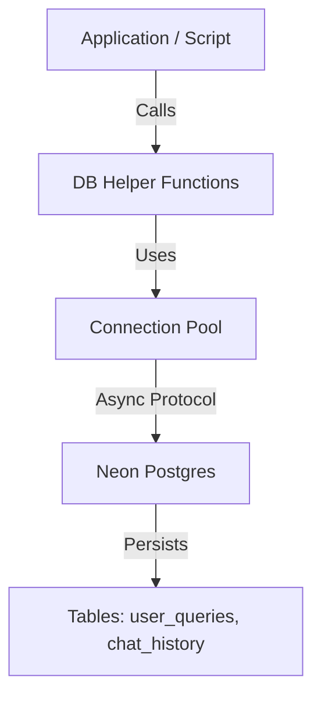

# Implementation Plan - Neon Postgres Chat History & Query Logging

## Technical Context

**Feature**: `015-neon-chat-history`

### Constraints
-   **Language**: Python 3.11+
-   **Database**: Neon Serverless Postgres (Free Tier)
-   **Driver**: `asyncpg`
-   **Input**: Data from application (user queries, chat context)
-   **Output**: Persisted records in Postgres tables

### Dependencies
-   `asyncpg`: For high-performance async database interaction.
-   `python-dotenv`: For managing the `DATABASE_URL` secret.

### Integrations
-   **FastAPI**: Future consumer of these database functions (logging middleware).
-   **Neon Postgres**: Storage backend.

## Constitution Check

### Compliance
-   **Data Privacy**: Storing user queries requires handling data securely.
    -   *Action*: Ensure `DATABASE_URL` is never committed (use `.env`).
    -   *Action*: Future iterations should consider data retention policies (out of scope for this setup).
-   **Performance**: Database I/O should not block the main application loop.
    -   *Action*: Use `asyncpg` for non-blocking operations.
    -   *Action*: Use connection pooling (`asyncpg.create_pool`).
-   **Reliability**: Database failures shouldn't crash the app.
    -   *Action*: Implement try/except blocks and logging for all DB operations.

### Gates
-   [x] **Gate 1**: Spec is clear and clarified (Driver, IDs, Schema).
-   [x] **Gate 2**: Research confirms `asyncpg` and `JSONB` suitability.
-   [x] **Gate 3**: Security best practices (env vars) are planned.

## Proposed Architecture

### Component Diagram

### Data Flow
1.  **Init**: App starts -> `setup_db.py` runs -> Connects to Neon -> Creates tables if missing.
2.  **Write**: `save_user_query(uid, text)` -> Acquires connection from pool -> `INSERT` -> Release connection.
3.  **Read**: `get_chat_history(uid)` -> Acquires connection -> `SELECT` -> Returns list of dicts -> Release connection.

## Implementation Steps

### Phase 1: Setup & Connection
-   [ ] Install dependencies (`asyncpg`, `python-dotenv`).
-   [ ] Create `src/database` directory structure.
-   [ ] Implement `src/database/connection.py` to handle `asyncpg` pool creation and `DATABASE_URL` loading.

### Phase 2: Schema Initialization
-   [ ] Implement `scripts/setup_db.py` to define and execute DDL (CREATE TABLE statements).
-   [ ] Verify table creation in Neon Console or via script output.

### Phase 3: Helper Functions
-   [ ] Implement `src/database/ops.py` containing:
    -   `save_user_query`
    -   `save_chat_history`
    -   `get_chat_history`
-   [ ] Add logging and error handling to all functions.

### Phase 4: Verification
-   [ ] Create `scripts/test_db_operations.py` to run an end-to-end test (Connect -> Insert -> Select).
-   [ ] Verify data persistence and format (UUIDs, JSONB).

## Testing Strategy
-   **Manual Verification**: Run `scripts/test_db_operations.py` and check console logs for success/error messages.
-   **Data Check**: Optionally inspect the database using an external SQL client to confirm rows are inserted.