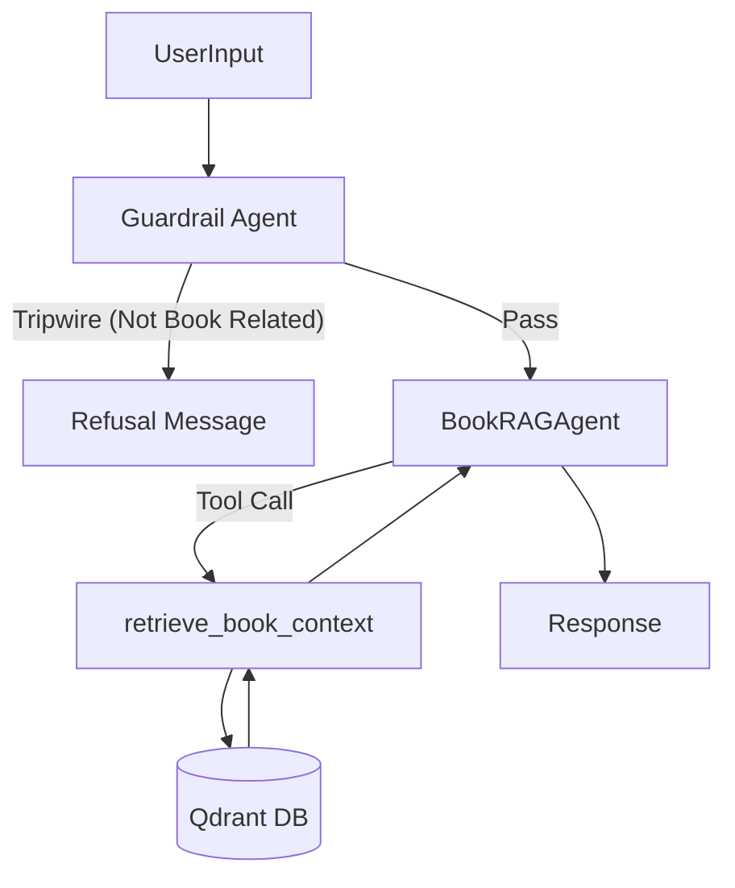

# Research: Book RAG Chatbot Agent (OpenAI Agents SDK)

**Branch**: `016-book-rag-agent`
**Date**: 2025-12-10
**Spec**: [specs/016-book-rag-agent/spec.md](spec.md)

## Decisions

### 1. Framework: OpenAI Agents SDK (`openai-agents-python`)
- **Decision**: Use the official SDK for structured agent definition.
- **Components**:
  - `Agent`: Core class for defining identity, instructions, and tools.
  - `Runner`: For executing the agent loop.
  - `@function_tool`: For exposing Python functions (like retrieval) to the agent.
  - `InputGuardrail/OutputGuardrail`: For enforcing constraints.
- **Directory**: `src/agents/book_rag_agent/` for all agent code.

### 2. Guardrails Implementation
- **Decision**: Use `input_guardrail` to check query relevance before processing.
- **Logic**: A lightweight `GuardrailAgent` will check if the query is "about the book" or "general knowledge".
- **Refusal**: If the guardrail trips, the system yields a refusal message immediately.
- **Alternative**: Use a system prompt instruction ("Do not answer..."). 
- **Rationale**: The SDK's `InputGuardrail` abstraction is cleaner and allows for a separate, faster model/check (e.g., `gpt-4o-mini`) to validate intent before the main expensive RAG agent runs.

### 3. Model & Gemini Compatibility
- **Requirement**: "Use Gemini API Key to run the Rag Chatbot Agent".
- **Constraint**: `openai-agents-python` defaults to OpenAI models.
- **Solution**: The SDK allows passing a `model` string. If using Gemini *via an OpenAI-compatible endpoint* (like Google's own OpenAI compatibility or a proxy), we can set `base_url` and `api_key` in the `OpenAI` client client passed to the Agent.
- **Assumption**: The user has a Gemini API key. Google Generative AI provides an OpenAI-compatible endpoint at `https://generativelanguage.googleapis.com/v1beta/openai/`.
- **Configuration**:
  - `base_url="https://generativelanguage.googleapis.com/v1beta/openai/"`
  - `api_key=GEMINI_API_KEY`
  - `model="gemini-1.5-flash"` (or similar).

### 4. Vector Database: Qdrant
- **Decision**: Continue using Qdrant (Cloud or Local) for vector storage.
- **Embeddings**: Continue using Cohere `embed-english-v3.0` as per existing data.
- **Tooling**: Wrap `qdrant_client.search()` in a `@function_tool` named `retrieve_book_context`.

## Unknowns & Risks

- **Gemini Compatibility**: While the endpoint exists, the Agents SDK might use specific features (like structured outputs or parallel tool calls) that Gemini's compatibility layer might handle differently. **Mitigation**: Fallback to `gpt-4o` if Gemini fails, but primary path is Gemini.
- **Guardrail Latency**: Adding an input guardrail adds a round-trip. **Mitigation**: Use a fast model (`gemini-1.5-flash`) for the guardrail.

## Architecture

