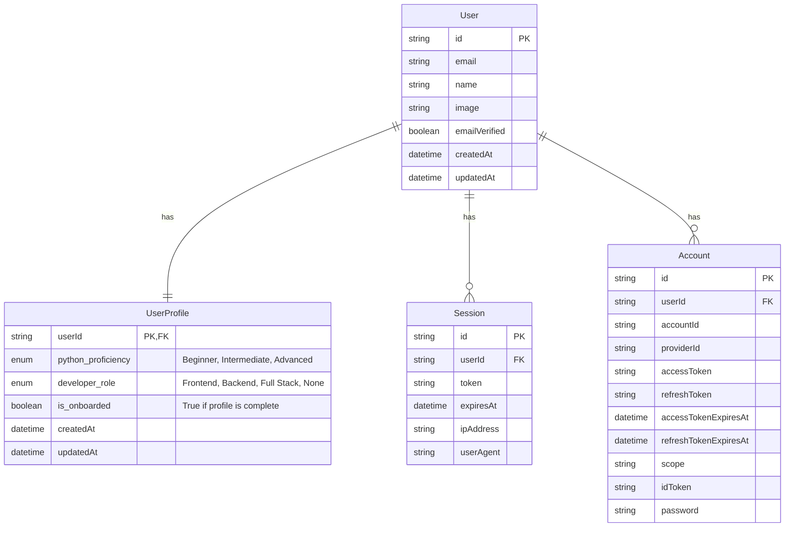

# Data Model

## Overview
The system uses a shared **Neon Postgres** database. The schema is divided into **Identity** (managed by Better-Auth) and **Profile** (custom extension).

## Entity Relationship Diagram (ERD)

## Schema Definitions

### 1. Identity Tables (Better-Auth Standard)

The `user`, `session`, `account`, and `verification` tables are automatically managed by Better-Auth.
Refer to Better-Auth documentation for exact schema.

### 2. User Profile Table (`user_profile`)

| Column Name | Type | Constraints | Description |
|---|---|---|---|
| `user_id` | `TEXT` | PK, FK(`user.id`) | Links to the Auth User. |
| `python_proficiency` | `TEXT` | NOT NULL | One of: 'Beginner', 'Intermediate', 'Advanced' |
| `developer_role` | `TEXT` | NOT NULL | One of: 'Frontend Developer', 'Backend Developer', 'Full Stack Developer', 'None' |
| `is_onboarded` | `BOOLEAN` | DEFAULT `FALSE` | Quick check for profile completion. |
| `created_at` | `TIMESTAMP` | DEFAULT NOW() | |
| `updated_at` | `TIMESTAMP` | DEFAULT NOW() | |

## Validation Rules

1. **Unique Profile**: A user can have at most one profile.
2. **Immutability**: Once `is_onboarded` is `TRUE`, `python_proficiency` and `developer_role` CANNOT be updated via API.
3. **Mandatory Fields**: Both `python_proficiency` and `developer_role` are required to set `is_onboarded = TRUE`.
